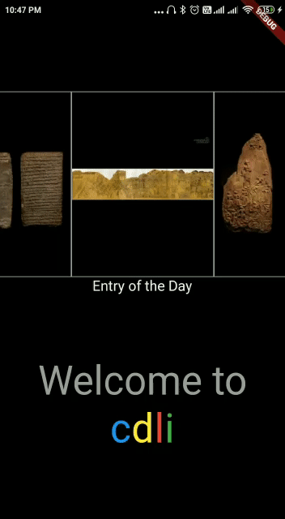

# CDLI Tablet App made using Flutter

<b>ABOUT</b> : CDLI already has it's Android and iPad application published on stores to allow users of app to learn about ancient history, one entry at a time. By "entry", I mean daily entry, the current apps add a new entry each day to give the users something new to look and learn each day. These entries contain an image of an artifact/cunieform/sculptures of historical interests, along with a description about them.  

<b>PURPOSE</b> : This project works on to build a new mobile application for CDLI developed
completely by Flutter so that we won’t need two seperate mobile applications for both
android and iOS devices, this would help in saving lots of time and energy which goes in
maintaining both the apps. This project also gave me an opportunity to learn about Flutter, and at the same time, to work on my first Open Source Project.  

>   And, the URL that we’ll be using to fetch data is :
https://cdli.ucla.edu/cdlitablet_android/fetchdata.php  

<b>FLOW DIAGRAM</b> 

<b>Source</b> : My brain + draw.io 

> <b>Note</b> : 	
> *​ ​: <i>Problem</i> -> ​ Here we are ​ not​ passing the date(or any attribute that uniquely
	identifies an entry) of the tapped item to CuneiformInfoPage() to display that
	entry’s info. Because if we do that, we’d once again call the API to fetch the data
	of the tapped item, and since async functions are time consuming, we should
	avoid them as much as possible. 
	<i>Solution</i> -> ​ Hence, what we can do is, we directly pass the tapped object
	itself to the CuneiformInfoPage(), so we can directly access the attribute value of
	the tapped object using the dot operator. Here we don’t need to call the API
	again to fetch data. 
> ➢ [1] : ​ This class is present inside Cuneiform_Collection_Page.dart file, it’s job is to
	fetch the ‘thumbnail’ and ‘date’ from the json array, and display them in form of
	GridView. 
> ➢ [2] : ​ This class is present inside the Cuneiform_Data.dart file (which stores our
	models), its job is to hold a Dart list of CuneiformsData to be displayed. 
> ➢ [3] : ​ This class is present inside Cuneiform_Info_Page.dart file, it’s job is to
	display ‘url’, ’title’, ‘blurb’ and ‘description’ of the tapped item.  
	
<b>SMALL DEMO :</b> 
The current CDLI mobile applications do not have a welcome screen, so I thought it could be one of the new features to add a new route which would include everything that the app contains, but in a brief manner. Due to this, user can quickly absorb what the app is all about. 
 
>Note :  
>-Here, the tag "Entry of the day" tag will automatically come under the latest entry each day.

>-I have used a timer to make sure that the image shift to left side after every 5 seconds.

## Getting Started

This project is a starting point for a Flutter application.

A few resources to get you started if this is your first Flutter project:

- [Lab: Write your first Flutter app](https://flutter.dev/docs/get-started/codelab)
- [Cookbook: Useful Flutter samples](https://flutter.dev/docs/cookbook)

For help getting started with Flutter, view our
[online documentation](https://flutter.dev/docs), which offers tutorials
samples, guidance on mobile development, and a full API reference.
